# Schéma UML - Base de Données MarketingBundle

**Date** : 2025-10-21
**Projet** : gorillias-marketing-bundle
**Type** : Diagramme de Classes UML (Entités Doctrine)

---

## 📊 Diagramme UML Complet - Base de Données

```mermaid
classDiagram
    %% ==========================================
    %% ENTITÉS CORE (Utilisateurs et Projets)
    %% ==========================================

    class User {
        +int id
        +UUID reference
        +string email
        +string password
        +string firstName
        +string lastName
        +string role
        +DateTime createdAt
        +DateTime updatedAt
        --
        +getClients() Client[]
    }

    class Client {
        +int id
        +UUID reference
        +string name
        +string email
        +string company
        +string phone
        +DateTime createdAt
        +DateTime updatedAt
        --
        +getUser() User
        +getProjects() Project[]
    }

    class Project {
        +int id
        +UUID reference
        +string name
        +text context
        +ProjectSourceTypeEnum sourceType
        +string source
        +ProjectStateEnum state
        +ProjectClientTypeEnum clientType
        +ProjectCompanyTypeEnum companyType
        +string companyName
        +string companyCategory
        +int budget
        +ProjectGoalTypeEnum goalType
        +ProjectCatchmentAreaTypeEnum catchmentAreaType
        +DateTime createdAt
        +DateTime updatedAt
        --
        +getClient() Client
        +getPersonas() Persona[]
        +getStrategies() Strategy[]
        +getCompetitors() Competitor[]
        +getAssets() Asset[]
        +getTasks() Task[]
        +getAgents() Agent[]
        +getRagFiles() RagFile[]
        +getOpportunities() Opportunity[]
        +getCatchmentAreas() CatchmentArea[]
    }

    %% Relations Core
    User "1" --> "*" Client : possède
    Client "1" --> "*" Project : possède

    %% ==========================================
    %% ENTITÉS MARKETING (Personas, Stratégies)
    %% ==========================================

    class Persona {
        +int id
        +UUID reference
        +string name
        +json demographics
        +json challenges
        +json goals
        +json channels
        +float conversionRate
        +float qualityScore
        +string vectorId
        +DateTime createdAt
        +DateTime updatedAt
        --
        +getProject() Project
        +getAudienceData() AudienceData[]
        +fromAgentArray(array) self
        +toAgentArray() array
    }

    class AudienceData {
        +int id
        +string platform
        +int audienceSize
        +float reachRate
        +float ctr
        +json metadata
        --
        +getPersona() Persona
    }

    class Strategy {
        +int id
        +UUID reference
        +string name
        +StrategyTypeEnum type
        +json objectives
        +json tactics
        +json kpis
        +json budgetAllocation
        +float confidenceScore
        +string vectorId
        +DateTime createdAt
        +DateTime updatedAt
        --
        +getProject() Project
        +getAssets() Asset[]
        +fromAgentArray(array) self
        +toAgentArray() array
    }

    class Competitor {
        +int id
        +UUID reference
        +string name
        +string url
        +json strengths
        +json weaknesses
        +text positioning
        +CompetitorStateEnum state
        +string vectorId
        +DateTime createdAt
        +DateTime updatedAt
        --
        +getProject() Project
        +fromAgentArray(array) self
        +toAgentArray() array
    }

    %% Relations Marketing
    Project "1" --> "*" Persona : contient
    Project "1" --> "*" Strategy : contient
    Project "1" --> "*" Competitor : contient
    Persona "1" --> "*" AudienceData : possède

    %% ==========================================
    %% ENTITÉS CONTENT (Assets)
    %% ==========================================

    class Asset {
        +int id
        +UUID reference
        +AssetTypeEnum type
        +string title
        +text content
        +json metadata
        +float qualityScore
        +AssetStateEnum state
        +DateTime createdAt
        +DateTime updatedAt
        --
        +getProject() Project
        +getStrategy() Strategy
        +fromAgentArray(array) self
        +toAgentArray() array
    }

    %% Relations Content
    Project "1" --> "*" Asset : contient
    Strategy "1" --> "*" Asset : génère

    %% ==========================================
    %% ENTITÉS SYSTEM (Tasks, Agent)
    %% ==========================================

    class Task {
        +int id
        +UUID reference
        +string agentName
        +string toolName
        +json arguments
        +json result
        +TaskStateEnum state
        +text errorMessage
        +DateTime startedAt
        +DateTime completedAt
        +DateTime createdAt
        +DateTime updatedAt
        --
        +getProject() Project
        +execute() void
        +markAsCompleted(result) void
        +markAsFailed(error) void
    }

    class Agent {
        +int id
        +UUID reference
        +string name
        +text description
        +string toneOfVoice
        +json personalityTraits
        +json brandValues
        +json customPrompts
        +json ragIds
        +json aiEngines
        +DateTime createdAt
        +DateTime updatedAt
        --
        +getProject() Project
        +getRagFiles() RagFile[]
        +fromAgentArray(array) self
        +toAgentArray() array
    }

    class RagFile {
        +int id
        +UUID reference
        +string filename
        +string originalName
        +string type
        +text content
        +string vectorId
        +json metadata
        +DateTime createdAt
        --
        +getProject() Project
        +getAgent() Agent
        +vectorize() void
    }

    %% Relations System
    Project "1" --> "*" Task : exécute
    Project "1" --> "*" Agent : possède
    Project "1" --> "*" RagFile : stocke
    Agent "1" --> "*" RagFile : utilise

    %% ==========================================
    %% ENTITÉS REFERENCE (Opportunity, CatchmentArea)
    %% ==========================================

    class Opportunity {
        +int id
        +UUID reference
        +string title
        +text description
        +OpportunityPriorityEnum priority
        +float estimatedImpact
        +float estimatedEffort
        +OpportunityStateEnum state
        +DateTime createdAt
        +DateTime updatedAt
        --
        +getProject() Project
    }

    class CatchmentArea {
        +int id
        +string name
        +CatchmentAreaTypeEnum type
        +string value
        +int radius
        +json metadata
        --
        +getProject() Project
    }

    %% Relations Reference
    Project "1" --> "*" Opportunity : identifie
    Project "1" --> "*" CatchmentArea : cible

    %% ==========================================
    %% ENUMS
    %% ==========================================

    class ProjectSourceTypeEnum {
        <<enumeration>>
        URL
        FILE
        PROJECT
    }

    class ProjectStateEnum {
        <<enumeration>>
        ACTIVE
        PAUSED
        COMPLETED
        ARCHIVED
    }

    class ProjectClientTypeEnum {
        <<enumeration>>
        B2B
        B2C
        B2B_B2C
    }

    class ProjectCompanyTypeEnum {
        <<enumeration>>
        STARTUP
        SME
        ENTERPRISE
    }

    class ProjectGoalTypeEnum {
        <<enumeration>>
        AWARENESS
        CONSIDERATION
        CONVERSION
        RETENTION
    }

    class ProjectCatchmentAreaTypeEnum {
        <<enumeration>>
        LOCAL
        NATIONAL
        INTERNATIONAL
    }

    class StrategyTypeEnum {
        <<enumeration>>
        AIDA
        CONTENT_MARKETING
        INBOUND
        OUTBOUND
    }

    class AssetTypeEnum {
        <<enumeration>>
        GOOGLE_ADS
        FACEBOOK_POST
        LINKEDIN_POST
        INSTAGRAM_POST
        EMAIL
        BING_ADS
        IAB
        ARTICLE
    }

    class AssetStateEnum {
        <<enumeration>>
        DRAFT
        READY
        PUBLISHED
        ARCHIVED
    }

    class TaskStateEnum {
        <<enumeration>>
        PENDING
        PROCESSING
        DONE
        ERROR
    }

    class CompetitorStateEnum {
        <<enumeration>>
        ACTIVE
        INACTIVE
    }

    class OpportunityPriorityEnum {
        <<enumeration>>
        LOW
        MEDIUM
        HIGH
        CRITICAL
    }

    class OpportunityStateEnum {
        <<enumeration>>
        IDENTIFIED
        PLANNED
        IN_PROGRESS
        COMPLETED
    }

    class CatchmentAreaTypeEnum {
        <<enumeration>>
        POSTAL_CODE
        CITY
        REGION
        COUNTRY
    }
```



---

## 📊 Vue Simplifiée - Relations Principales


---

## 📋 Dictionnaire des Relations

### Relations 1:N (One-to-Many)

| Parent | Enfant | Relation | Cascade |
|--------|--------|----------|---------|
| User | Client | 1:N | DELETE CASCADE |
| Client | Project | 1:N | DELETE CASCADE |
| Project | Persona | 1:N | DELETE CASCADE |
| Project | Strategy | 1:N | DELETE CASCADE |
| Project | Competitor | 1:N | DELETE CASCADE |
| Project | Asset | 1:N | DELETE CASCADE |
| Project | Task | 1:N | DELETE CASCADE |
| Project | Agent | 1:N | DELETE CASCADE |
| Project | RagFile | 1:N | DELETE CASCADE |
| Project | Opportunity | 1:N | DELETE CASCADE |
| Project | CatchmentArea | 1:N | DELETE CASCADE |
| Persona | AudienceData | 1:N | DELETE CASCADE |
| Strategy | Asset | 1:N | DELETE SET NULL |
| Agent | RagFile | 1:N | DELETE CASCADE |

### Index Recommandés

```sql
-- Index de performance
CREATE INDEX idx_project_client ON project(client_id);
CREATE INDEX idx_project_state ON project(state);
CREATE INDEX idx_project_created ON project(created_at);

CREATE INDEX idx_persona_project ON persona(project_id);
CREATE INDEX idx_persona_quality ON persona(quality_score);

CREATE INDEX idx_strategy_project ON strategy(project_id);

CREATE INDEX idx_competitor_project ON competitor(project_id);

CREATE INDEX idx_asset_project ON asset(project_id);
CREATE INDEX idx_asset_strategy ON asset(strategy_id);
CREATE INDEX idx_asset_type ON asset(type);
CREATE INDEX idx_asset_state ON asset(state);

CREATE INDEX idx_task_state ON task(state);
CREATE INDEX idx_task_agent ON task(agent_name);

CREATE UNIQUE INDEX unique_audience_persona_platform ON audience_data(persona_id, platform);
```

---

## 🎨 Diagramme Entité-Relation (ERD)


---

## 📊 Statistiques Base de Données

### Volume par Entité (Projet Moyen)

| Entité | Enregistrements/Projet | Total 100 Projets |
|--------|------------------------|-------------------|
| User | - | 50 |
| Client | - | 100 |
| Project | 1 | 100 |
| Persona | 3-5 | 400 |
| AudienceData | 15-25 | 2,000 |
| Strategy | 5-10 | 750 |
| Competitor | 10-20 | 1,500 |
| Asset | 50-100 | 7,500 |
| Task | 100-500 | 30,000 |
| Agent | 1-3 | 200 |
| RagFile | 10-50 | 3,000 |
| Opportunity | 5-15 | 1,000 |
| CatchmentArea | 1-5 | 300 |
| **TOTAL** | **~200-730** | **~46,800** |

### Taille Estimée Base de Données

**Pour 100 projets marketing** :
- Tables : 13 tables
- Enregistrements : ~46,800 enregistrements
- Taille estimée : 500 MB - 1 GB
- Index : ~30 index
- Relations : 14 clés étrangères

---

## 🔗 Mapping ChromaDB ↔ SQL

### Collections Vectorielles

| Collection ChromaDB | Table SQL | Champ Lien |
|---------------------|-----------|------------|
| **personas** | persona | vector_id (UUID) |
| **competitors** | competitor | vector_id (UUID) |
| **brands** | agent | rag_ids (JSON) |
| **strategies** | strategy | vector_id (UUID) |
| **documents** | rag_file | vector_id (UUID) |

### Workflow Hybride


---

## 📝 Notes Implémentation

### Traits Doctrine Communs

```php
trait TimestampableTrait
{
    #[ORM\Column(type: 'datetime')]
    private ?\DateTimeInterface $createdAt = null;

    #[ORM\Column(type: 'datetime')]
    private ?\DateTimeInterface $updatedAt = null;

    #[ORM\PrePersist]
    public function setCreatedAtValue(): void
    {
        $this->createdAt = new \DateTime();
        $this->updatedAt = new \DateTime();
    }

    #[ORM\PreUpdate]
    public function setUpdatedAtValue(): void
    {
        $this->updatedAt = new \DateTime();
    }
}

trait UuidTrait
{
    #[ORM\Column(type: 'uuid', unique: true)]
    private ?Uuid $reference = null;

    public function __construct()
    {
        $this->reference = Uuid::v4();
    }

    public function getReference(): ?Uuid
    {
        return $this->reference;
    }
}
```

### Validation Constraints

```php
use Symfony\Component\Validator\Constraints as Assert;

class Project
{
    #[Assert\NotBlank(message: "Le nom du projet est requis")]
    #[Assert\Length(min: 3, max: 255)]
    private ?string $name = null;

    #[Assert\NotBlank(groups: ['creation'])]
    #[Assert\Url]
    private ?string $source = null;

    #[Assert\PositiveOrZero]
    #[Assert\LessThanOrEqual(value: 1000000)]
    private ?int $budget = null;
}

class Persona
{
    #[Assert\NotBlank]
    #[Assert\Length(min: 2, max: 255)]
    private ?string $name = null;

    #[Assert\Range(min: 0.0, max: 1.0)]
    private ?float $qualityScore = null;

    #[Assert\Range(min: 0.0, max: 1.0)]
    private ?float $conversionRate = null;
}
```

---

## 🎯 Recommandations SQL

### Performance

```sql
-- Partitionnement si > 1M tasks
ALTER TABLE task PARTITION BY RANGE (YEAR(created_at)) (
    PARTITION p2024 VALUES LESS THAN (2025),
    PARTITION p2025 VALUES LESS THAN (2026),
    PARTITION pmax VALUES LESS THAN MAXVALUE
);

-- Index composites pour requêtes fréquentes
CREATE INDEX idx_asset_project_type_state ON asset(project_id, type, state);
CREATE INDEX idx_task_project_state ON task(project_id, state);
```

### Archivage

```sql
-- Table archive pour projets terminés
CREATE TABLE project_archive LIKE project;
CREATE TABLE persona_archive LIKE persona;
-- etc.

-- Trigger archivage automatique
CREATE TRIGGER archive_completed_project
AFTER UPDATE ON project
FOR EACH ROW
BEGIN
    IF NEW.state = 'ARCHIVED' THEN
        INSERT INTO project_archive SELECT * FROM project WHERE id = NEW.id;
    END IF;
END;
```

---

**Schéma UML généré** : 2025-10-21
**Format** : Mermaid (compatible Markdown)
**Conversion** : PlantUML, Draw.io, Lucidchart possible
