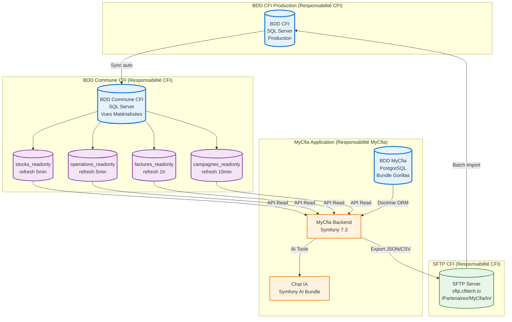
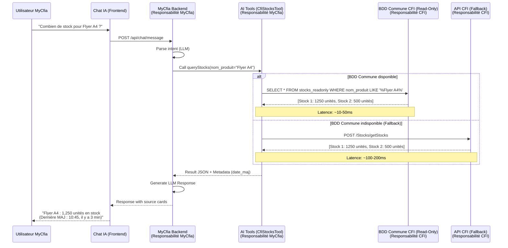
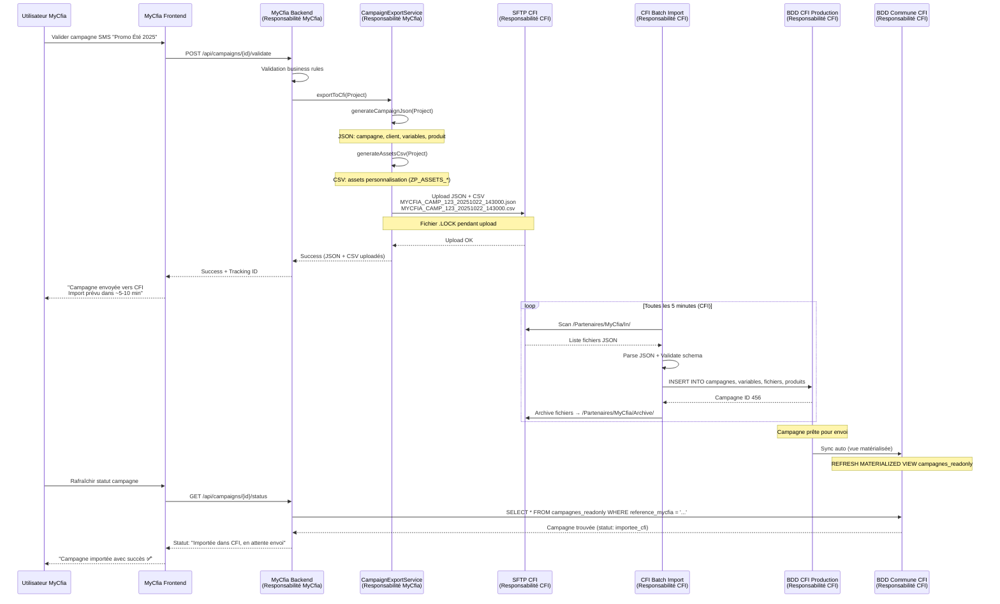
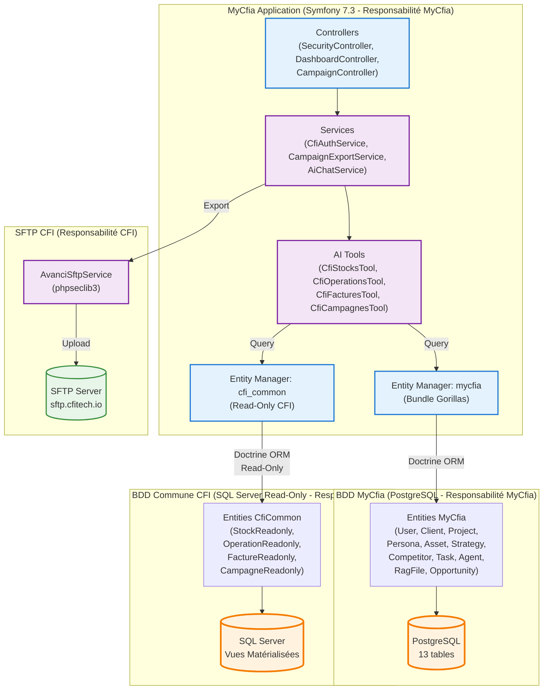
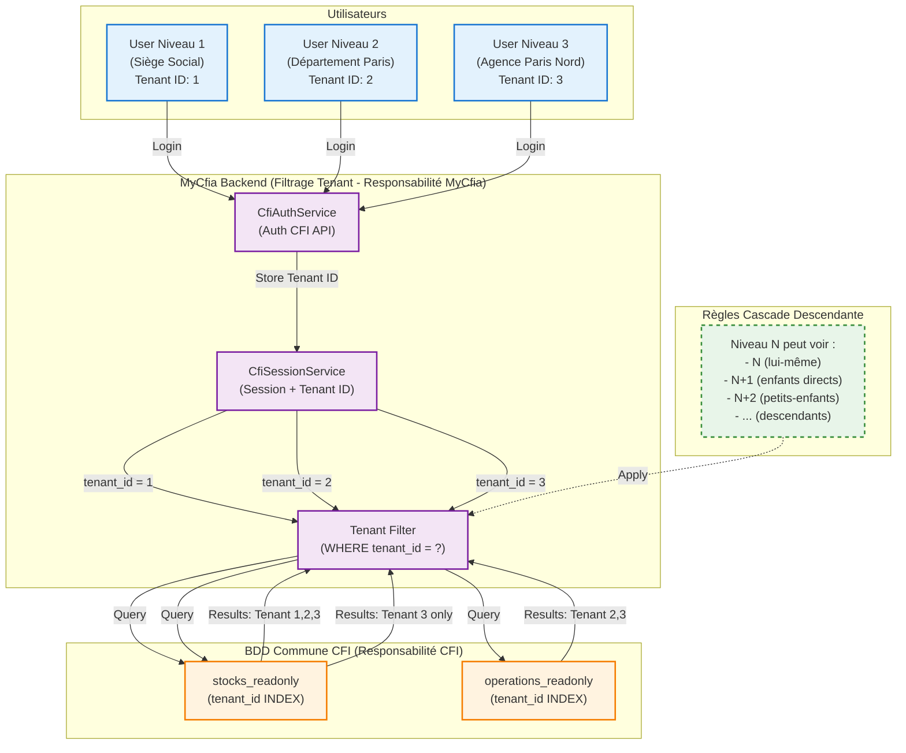
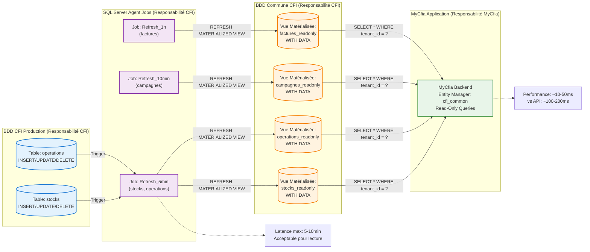
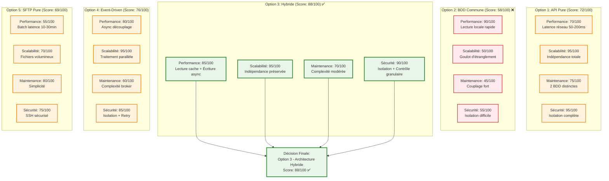
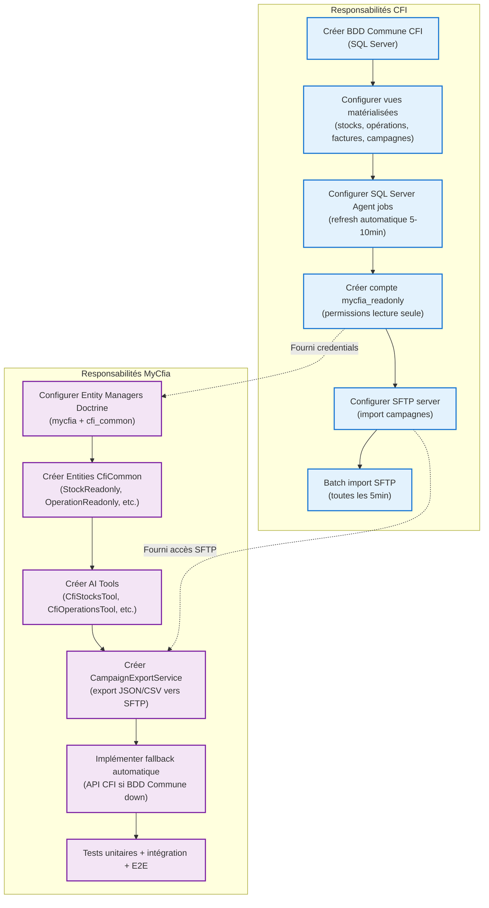

# Schémas Architecture Hybride CFI-MyCfia

**Date** : 2025-10-22
**Projet** : myCfia - Architecture Recommandée (Option 3)

---

## 📐 Vue d'Ensemble Système



---

## 🔄 Flux de Lecture (CFI → MyCfia)



---

## 📤 Flux d'Écriture (MyCfia → CFI)



---

## 🏗️ Architecture Technique MyCfia (Multi-Database)



---

## 🔐 Architecture Sécurité & Multi-Tenancy



---

## 📊 Synchronisation BDD Commune CFI (Vues Matérialisées)



---

## 🛡️ Résilience & Fallback

```mermaid
graph TB
    subgraph "Scénario Normal"
        USER1["Utilisateur MyCfia"]
        AI_TOOL1["AI Tool: queryStocks()<br/>(Responsabilité MyCfia)"]
        COMMON1[(BDD Commune CFI<br/>Disponible ✅<br/>(Responsabilité CFI))]
        RESULT1["Résultat: ~10-50ms<br/>Données fraîches (max 5min)"]
    end

    subgraph "Scénario Dégradé (Panne BDD Commune)"
        USER2["Utilisateur MyCfia"]
        AI_TOOL2["AI Tool: queryStocks()<br/>(Responsabilité MyCfia)"]
        COMMON2[(BDD Commune CFI<br/>Indisponible ❌<br/>(Responsabilité CFI))]
        FALLBACK["Fallback automatique:<br/>CfiApiService<br/>(Responsabilité MyCfia)"]
        API[(API CFI Swagger<br/>Disponible ✅<br/>(Responsabilité CFI))]
        RESULT2["Résultat: ~100-200ms<br/>Données temps réel"]
        LOG["Logger: Warning<br/>'BDD Commune CFI down,<br/>fallback API CFI'"]
    end

    subgraph "Scénario Critique (Panne Totale)"
        USER3["Utilisateur MyCfia"]
        AI_TOOL3["AI Tool: queryStocks()<br/>(Responsabilité MyCfia)"]
        COMMON3[(BDD Commune CFI<br/>Indisponible ❌<br/>(Responsabilité CFI))]
        API2[(API CFI Swagger<br/>Indisponible ❌<br/>(Responsabilité CFI))]
        ERROR["Erreur: 'Service CFI<br/>temporairement indisponible.<br/>Réessayez dans quelques minutes.'"]
        ALERT["Alertes:<br/>- Email admin<br/>- Slack/Teams notification<br/>- Incident Monitoring"]
    end

    %% Flux Normal
    USER1 --> AI_TOOL1
    AI_TOOL1 --> COMMON1
    COMMON1 --> RESULT1

    %% Flux Dégradé
    USER2 --> AI_TOOL2
    AI_TOOL2 --> COMMON2
    COMMON2 -->|Exception| FALLBACK
    FALLBACK --> API
    API --> RESULT2
    COMMON2 -.->|Log| LOG

    %% Flux Critique
    USER3 --> AI_TOOL3
    AI_TOOL3 --> COMMON3
    COMMON3 -->|Exception| API2
    API2 -->|Exception| ERROR
    API2 -.->|Trigger| ALERT

    %% Styles
    classDef normalStyle fill:#e8f5e9,stroke:#388e3c,stroke-width:2px
    classDef degradeStyle fill:#fff3e0,stroke:#f57c00,stroke-width:2px
    classDef critiqueStyle fill:#ffebee,stroke:#d32f2f,stroke-width:2px

    class USER1,AI_TOOL1,COMMON1,RESULT1 normalStyle
    class USER2,AI_TOOL2,COMMON2,FALLBACK,API,RESULT2,LOG degradeStyle
    class USER3,AI_TOOL3,COMMON3,API2,ERROR,ALERT critiqueStyle
```

---

## 📈 Matrice Décisionnelle (Comparaison Options)



---

## 🔧 Diagramme Responsabilités CFI vs MyCfia



---

**Document créé** : 2025-10-22
**Type** : Schémas Architecture Hybride (Option 3)
**Format** : Mermaid (compatible GitHub, GitLab, VS Code Preview)
**Version** : 2.0
**Statut** : ✅ Révisé - Prêt pour validation
